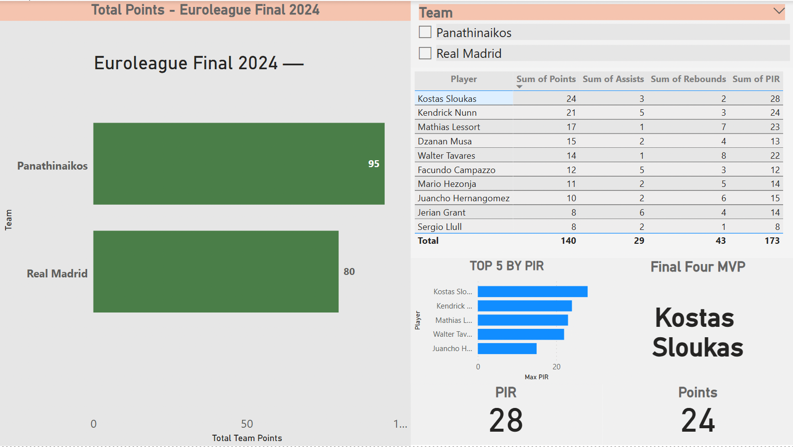

# Euroleague Final 2024 — Power BI Dashboard (Dynamic MVP)

Interactive Power BI dashboard built to analyze the Euroleague Final 2024 with a **dynamic MVP per team** selection and clean, interview-ready layout.
## Dashboard Preview

## Highlights
- **Team slicer → Dynamic MVP**
  - Selecting a team updates the MVP name, MVP PIR, and MVP points.
- **MVP row highlighting**
  - Conditional formatting highlights the MVP player row inside the table.
- **Top 5 by PIR**
  - Quick view of best performers by PIR.
- **Clean KPI cards**
  - MVP PIR and MVP Points displayed as headline metrics.

## Data Model
- `player_stats` (player-level stats: Points, Assists, Rebounds, PIR, Team)
- `team_stats` (team-level aggregates)
- Relationship: `player_stats[Team]` → `team_stats[Team]`

## Measures (core)
- `Max PIR` (dynamic)
- `MVP Name` (dynamic)
- `MVP Points` (dynamic)
- `Row is MVP` (flag for conditional formatting)

## Files
- `dashboard/Euroleague_Final_2024.pbix` — Power BI report
- `dashboard/dashboard-preview.jpg` — report screenshot

## How to Use
1. Download the `.pbix` file.
2. Open with **Power BI Desktop**.
3. Use the **Team slicer** to switch teams and see the MVP update.

## Notes
- This project is designed as a **portfolio / interview demo** focusing on dynamic measures, filtering behavior, and clean reporting design.

---

**Author:** Vasilis Posnakidis  
